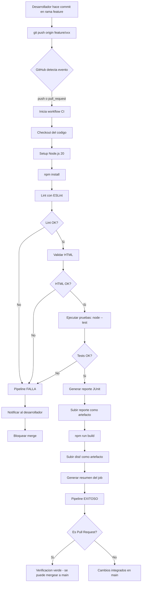

# Diagrama de Flujo de Integración Continua

## Visión general del pipeline

El pipeline de Integración Continua (CI) del proyecto **FastFood Manager** se
ejecuta automáticamente en GitHub Actions ante los siguientes eventos:

- `push` a las ramas `main`, `develop`, `feature/**` y `fix/**`
- Apertura o actualización de un *Pull Request* hacia `main`
- Ejecución manual desde la pestaña *Actions* (`workflow_dispatch`)

## Diagrama de flujo (Mermaid)

## Etapas detalladas

| # | Etapa | Herramienta | Salida |
|---|-------|-------------|--------|
| 1 | Checkout | `actions/checkout@v4` | Código del repo en el runner |
| 2 | Setup Node | `actions/setup-node@v4` | Node.js 20 disponible |
| 3 | Install | `npm install` | `node_modules/` poblado |
| 4 | Lint | `eslint lib/ tests/` | Análisis estático aprobado |
| 5 | HTML Validation | `html-validate index.html` | HTML correcto |
| 6 | Tests | `node --test tests/utils.test.js` | 18 pruebas ejecutadas |
| 7 | Report | `node --test --test-reporter=junit` | `reports/junit.xml` |
| 8 | Upload Report | `actions/upload-artifact@v4` | Artefacto descargable |
| 9 | Build | `node scripts/build.js` | `dist/` con archivos finales |
| 10 | Upload Build | `actions/upload-artifact@v4` | Entregable descargable |
| 11 | Summary | `$GITHUB_STEP_SUMMARY` | Reporte visible en GitHub |

## Política de fallos

- Cualquier paso que falle (lint, validación, tests) **detiene el pipeline**.
- En un *Pull Request*, un pipeline rojo **bloquea el merge** hacia `main`.
- Los reportes y artefactos se generan incluso si los tests fallan
  (`if: always()`), permitiendo diagnosticar la causa del fallo.

## Beneficios para la Gestión de la Configuración

- **Trazabilidad:** cada commit queda asociado a un resultado de pipeline.
- **Calidad continua:** el código nunca llega a `main` sin pasar las
  verificaciones automáticas.
- **Reproducibilidad:** el entorno de build es idéntico en todas las
  ejecuciones (Ubuntu + Node 20).
- **Entrega Continua:** los artefactos `fastfood-manager-dist` están listos
  para desplegar tras cada integración exitosa.
